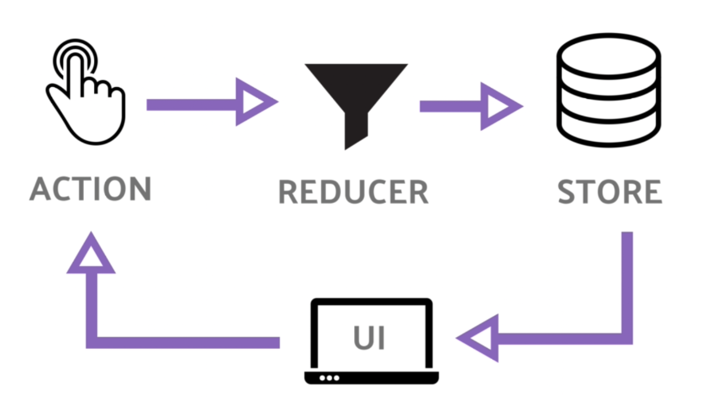
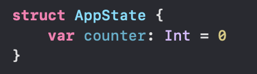
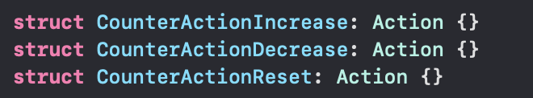
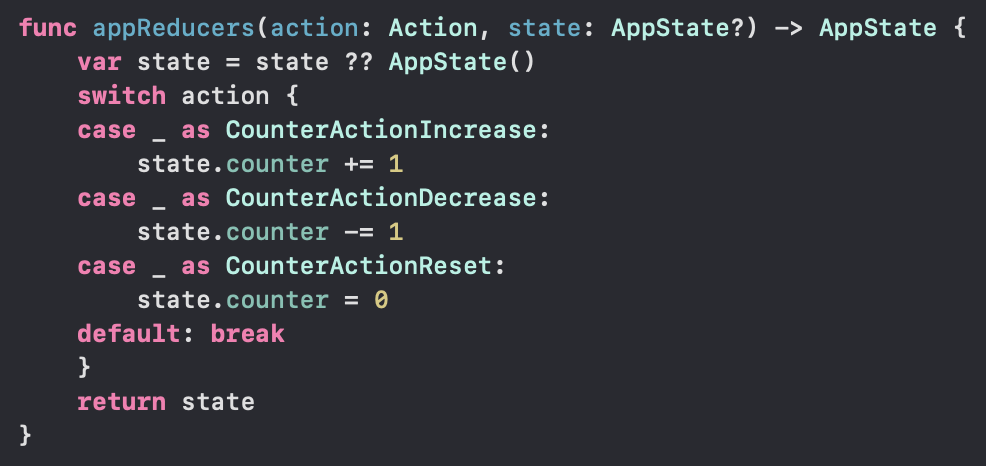
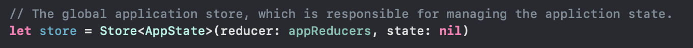

# Redux
***
# Introduction

Redux giống như kiến trúc luồng dữ liệu một chiều trong Swift. Mục tiêu chính là phân tách nhiệm vụ giữa các `class`, cụ thể:

- **State**: đại diện cho trạng thái của ứng dụng. Chỉ có một và có thể chia thành các trạng thái nhỏ hơn giúp quản lý dễ dàng hơn, dễ debug, bảo trì, sửa lỗi, ...
- **Views**: được cập nhật lại ngay khi state thay đổi. 
- **State Change**s: trong **Redux**, chúng ta chỉ có thể thay đổi các state thông qua các action. 

# Mục lục:
> [Giới thiệu](#giới-thiệu)
> 
> [Why Redux](#tại-sao-dùng-redux?)
> 
> [How Redux works](#cách-vận-hành)
> 
> [Guide](#cài-đặt)
> 
> [How to use](#how-to-use)
> 
> [Demo](#Demo)

-
# Giới thiệu
REDUX là một kiến trúc **unidirectional Data Flow** được xây dựng trên nền tảng tư tưởng của [Flux](#https://facebook.github.io/flux/) do **FB** giới thiệu. Mục đích là giúp tạo ra 1 lớp quản lý trạng thái (**State**) của ứng dụng.

Với **Redux**, `state` của ứng dụng được lưu giữ ở một nơi gọi là `store` và mỗi `component` đều có thể `access` bất kỳ `state` nào mà chúng muốn từ `store` này.

Để hiểu và nắm bắt được cơ bản về **Redux**, cần nắm vững 3 nguyên lý dưới đây:

1. **Single source of truth**: State của toàn bộ ứng dụng được lưu trong 1 object duy nhất là **Store**, giúp cho việc quan sát và quản lý trạng thái được thuận tiện hơn, các vấn đề đồng bộ dữ liệu được giải quyết toàn vẹn. Ngoài ra, việc này cho chúng ta biết được 
2. **State is read-only**: Để thay đổi state thì cách duy nhất là thông qua các **Action**. Bởi vì mọi sự thay đổi được tập trung tại 1 điểm và xảy ra tuần tự nên chúng ta dễ dàng có thể theo dõi được sự thay đổi đó. 
3. **Changes are made with pure functions**: để thay đổi trạng thái của ứng dụng bởi 1 action, chúng ta sử dụng **Reducer** (pure function). 

# Tại sao dùng Redux?

Khi bắt đầu tiếp cận với iOS thì chúng ta cơ bản đã trải nghiệm mô hình MVC (Model - View - Controller) đầu tiên. Theo thời gian thì MVC dần lộ ra những khuyết điểm:

- **Controller** đảm nhiệm quá nhiều tác vụ như business, logic, view, animation, ...

- **View** và **Controller**

- Việc viết **Unit Tests** rất khó khăn vì **Controller** phải thao tác cả **View** và **Model**

**MVVM**, **VIPER** được sinh ra để giải quyết được các vấn đề trên , tuy nhiên cả 2 mô hình này đều là **multidirectional data flow**, nghĩa là dữ liệu sẽ được phân tán nhiều nơi trong app, điều này có thể gây khó khăn cho việc `debug` cũng như quản lý các tài nguyên sử dụng chung. Mô hình Redux có thể giải quyết được vấn đề đó - một kiến trúc quản lý luồng dữ liệu theo một hướng (**unidirectional Data Flow**) như đề cập ở phần [trên](#Giới thiệu).

Lợi ích của Redux:

- Không cần quan tâm đến việc đồng bộ hóa dữ liệu, thành phần trong hệ thống.
- Tách biệt vai trò các thành phần.
- Dễ dàng mở rộng, thêm chức năng.
- Dễ dàng debug, unit tests, ...

# Cách vận hành

Trước khi hiểu rõ được cách thức vận hành của **Redux**, chúng ta cần tìm hiểu các thành phần cơ bản của nó.

> <h2>1. State</h2>
> 
> Là đại diện dữ liệu của toàn bộ ứng dụng.
> 
> Là 1 object chứa trạng thái và dữ liệu của ứng dụng. 
> 
> Nên là *Struct* để đảm bảo nguyên lý 2: **State is read-only**.

> 
> <h2>2. Actions</h2>
> 
> Diễn tả 1 hành động trong hệ thống.
> 
> Không có ràng buộc về bất kỳ kiểu dữ liệu nào, do đó có thể sử dụng: `Struct, enum`, miễn sao kiểu dữ liệu được đồng nhất trong 1 dự án.
> 
> <h2>3. Reducers</h2>
> 
> Có nhiệm vụ chuyển đổi trạng thái hiện tại sang trạng thái mới. 
> 
> Phải là 1 pure function, đảm bảo: 
> 
> > Không thay đổi tham số truyền vào nhằm mục đích không thay đổi tới các thành phần liên quan trong ứng dụng.
> >
> > Không phụ thuộc vào các trạng thái bên ngoài.
> 
> <h2>4. Store</h2>
> 
> Là nơi tập hợp các **state**, **reducer**, **dispatcher**, **observer** lại với nhau. Khi **action** gửi đến **store**, nó sẽ được áp dụng thông qua các **reducer**, **state** sau đó mới được chuyển cho tất cả những **obsever**.
>  
> <h2>5. ActionCreator</h2>
> 
> <h2>6. Middleware</h2>
> 
> Các bạn có thể tham khảo chi tiết [tại đây](https://medium.com/@meagle/understanding-87566abcfb7a#.98zx2o6x2)

Cách hoạt động của Redux như sau:

1. Khi có 1 event được dispatch từ **View** => tạo ra 1 **Action** mô tả về event đó.
2. **Action** sau đó sẽ được gửi đến **Reducer** để xử lý.
3. **Reducer** sẽ nhận **Action** và dựa vào mô tả của **Action** để tạo ra một **State** mới và lưu tại **Store**
4. Các **ViewController** đã được subsciber đến **Store** sẽ nhận được sự thay đổi và tiến hành **update UI**.

# Cài đặt
Có nhiều cách làm việc với **Redux**, dưới đây mình sẽ apply ReSwift framework vào project.

- Tham khảo tài liệu của ReSwift [tại đây](http://reswift.github.io/ReSwift/master/index.html)

<h2>Installation</h2>

<h3>Cocoapods</h3>

Cài đặt ReSwift với Cocoapods bằng cách thêm dòng dưới vào trong `Podfile`:

> `pod 'ReSwift'`
> 
> and run 
> 
> `pod install` / `bundle exec pod install`
> 

<h3>Carthage</h3>

Cài đặt ReSwift với Carthage bằng cách thêm dòng dưới vào trong `Cartfile`:

> `github "ReSwift/ReSwift"`
>
> and run 
> 
> `carthage update --platform iOS`

# How to use
Để hiểu rõ hơn, chúng ta sẽ làm 1 Demo nhỏ với **Redux** bằng *Swift*.

Tiến hành tạo các file tương ứng các thành phần cơ bản trong **Redux**:

<h3>1. State </h3>

<h3>2. Action </h3>

<h3>3. Reducer </h3>

<h3>4. Views </h3>
Note: Tại **AppDelegate.swift** ta khai báo 1 global **Store** của app:

<h2>Output</h2>

# Demo
[Code Demo](https://github.com/quocdoan-dev/ReduxDemo)

